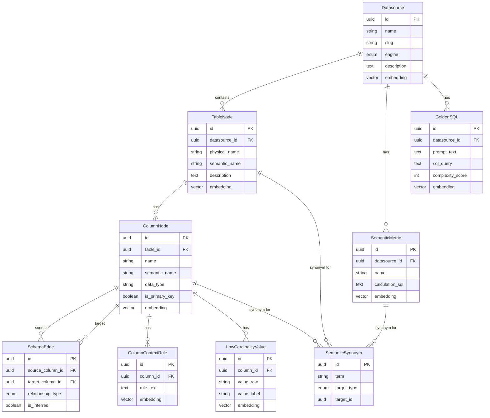
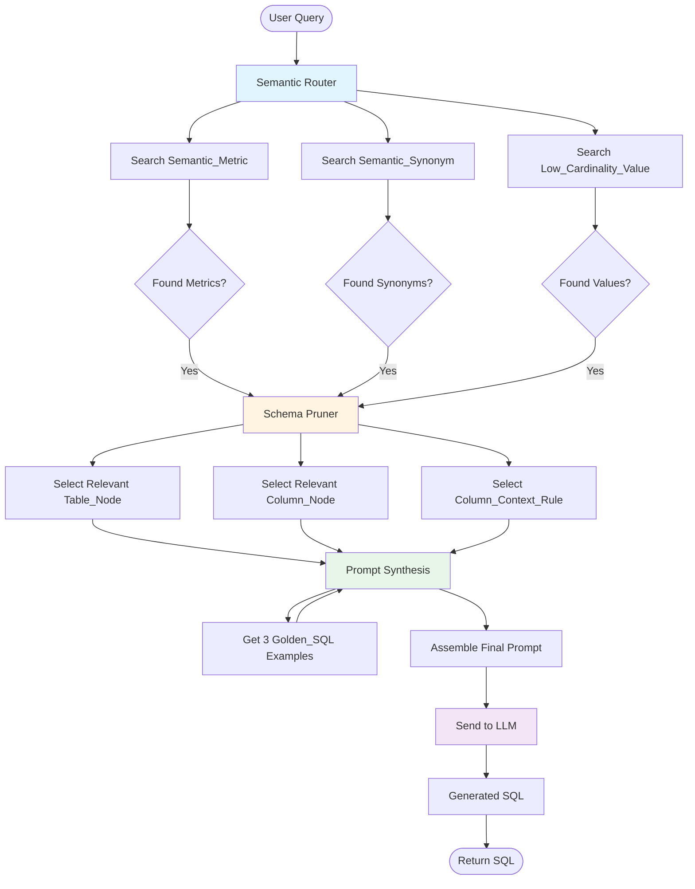
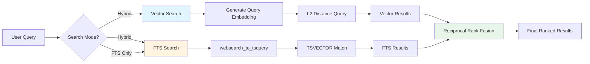
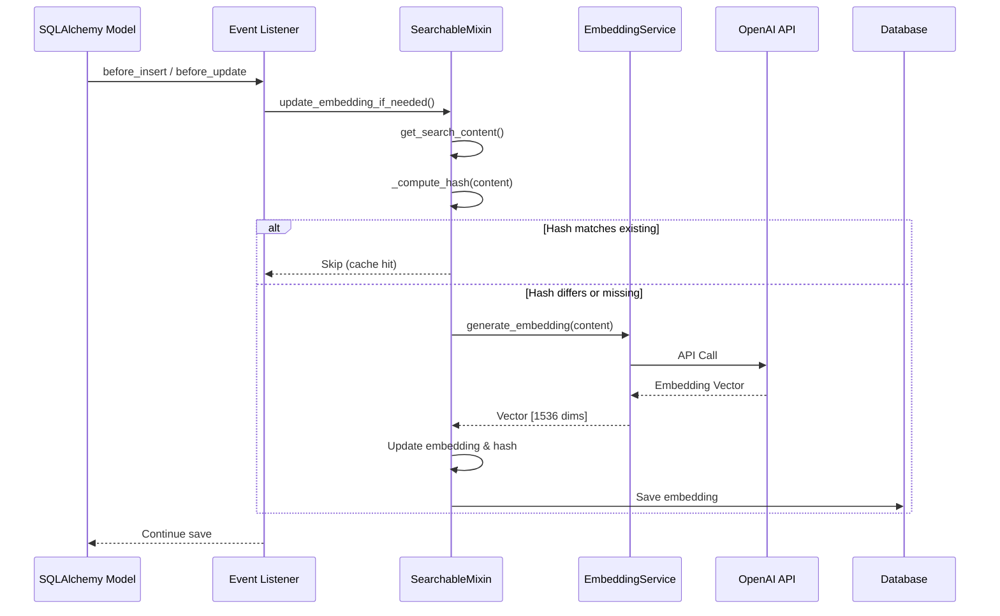

# 🏛 Semantic SQL Engine: The Architecture Manifesto

## 1. Core Registry (Physical Ontology)
Questa sezione mappa la "Verità Fisica" dei dati. Non contiene logica di business, ma rappresenta fedelmente lo schema grezzo su cui il motore deve operare sintatticamente.

### Entity: Datasource
Il perimetro fisico di interrogazione.
* `id` (UUID): Primary Key.
* `name` (String): Identificativo mnemonico (es. "Sales DWH Prod").
* `engine` (Enum): Il dialetto SQL target (postgres, bigquery, snowflake, tsql). Determina il syntax flavor usato dall'LLM.
* `schema_scan_config` (JSONB): Whitelist/Blacklist di schemi e tabelle per l'ingestione automatica.

### Entity: Table_Node
I nodi principali del knowledge graph.
* `id` (UUID)
* `datasource_id` (FK)
* `physical_name` (String): Nome reale nel DB (t_orders_v2).
* `semantic_name` (String): Nome "pulito" per l'LLM (Orders Table).
* `description` (Text): Metadato curato descrittivo. Driver primario per il retrieval vettoriale macro.
* `ddl_context` (Text): Lo statement CREATE TABLE minimizzato. Serve all'LLM per vedere la struttura esatta durante la generazione.
* `embedding` (Vector): Embedding denso di (Semantic Name + Description).

### Entity: Column_Node
Gli attributi atomici.
* `id` (UUID)
* `table_id` (FK)
* `name` (String): Nome fisico (usr_id).
* `data_type` (String): Tipo nativo (VARCHAR, INT).
* `is_primary_key` (Boolean): Critico per identificare le entità uniche.
* `embedding` (Vector): Embedding del nome e dei metadati per la ricerca fine (es. "Data registrazione" -> created_at).

### Entity: Schema_Edge (Topology)
Le autostrade dei dati. Definisce come le tabelle possono essere collegate legalmente.
* `source_column_id` (FK)
* `target_column_id` (FK)
* `relationship_type` (Enum): 1:1, 1:N, N:N.
* `is_inferred` (Boolean): False se esiste una FK fisica, True se la relazione è virtuale (suggerita dalla semantica ma non enforceata dal DB).

## 2. The Semantic Layer (Business Logic Abstraction)
Il cuore dell'intelligenza. Qui si disaccoppia il linguaggio dell'utente dalla complessità dello schema, definendo concetti calcolati e sinonimi.

### Entity: Semantic_Metric
Definizione autoritativa dei KPI aziendali. Impedisce all'LLM di inventare formule.
* `id` (UUID)
* `name` (String): Es. "ARR - Annual Recurring Revenue".
* `description` (Text): Spiegazione di business per il retrieval.
* `calculation_sql` (Text): Lo snippet SQL puro (es. SUM(subscription_value) * 12).
* `required_tables` (JSONB): Lista delle tabelle fisiche necessarie per istanziare questa metrica.
* `embedding` (Vector): Vettore del concetto di business (es. match su "quanto guadagniamo l'anno").

### Entity: Semantic_Synonym
Il dizionario di traduzione Dominio <-> Dati.
* `id` (UUID)
* `term` (String): Il termine usato dagli umani (es. "Abbonato", "Acquirente", "Lead").
* `target_type` (Enum): TABLE, COLUMN, METRIC, VALUE.
* `target_id` (UUID): Riferimento all'entità fisica o logica mappata.
* **Nota Tecnica**: Risolve l'ambiguità lessicale prima ancora di chiamare l'LLM (Determinismo > Probabilità).

## 3. Context & Value Awareness (Data Intelligence)
Regole e dati che risiedono dentro le colonne, essenziali per evitare allucinazioni logiche.

### Entity: Column_Context_Rule
Regole di interpretazione dei dati ("Tribal Knowledge").
* `id` (UUID)
* `column_id` (FK)
* `rule_text` (Text): Istruzione esplicita. Es: "Se questa data è NULL, l'ordine è in corso" oppure "Status 99 significa Cancellato".
* `embedding` (Vector): Permette di recuperare la regola solo quando la query tocca l'argomento pertinente.

### Entity: Low_Cardinality_Value
Indice dei valori di filtro per colonne categoriche (Lookup Table vettoriale).
* `id` (UUID)
* `column_id` (FK)
* `value_raw` (String): Il dato reale nel DB (es. EMR).
* `value_label` (String): Etichetta semantica/estesa (es. Emilia-Romagna).
* `embedding` (Vector): Vettore dell'etichetta.
* **Funzionamento**: Utente chiede "Clienti emiliani" -> Vector Match su Emilia-Romagna -> Prompt Inject: WHERE region_code = 'EMR'.

## 4. Adaptive Learning & Feedback (RLHF Loop)
Il sistema apprende e gestisce l'incertezza interagendo con l'utente e lo storico.

### Entity: Ambiguity_Log
Registro delle incertezze per il miglioramento continuo.
* `id` (UUID)
* `user_query` (Text): La domanda originale (es. "Fatturato 2024").
* `detected_ambiguity` (JSONB): Le opzioni rilevate (es. ["Fatturato Lordo", "Fatturato Netto"]).
* `user_resolution` (Text): La scelta effettuata dall'utente.
* **Nota**: Alimenta il sistema di preferenze future.

### Entity: Golden_SQL (Few-Shot Store)
La memoria a lungo termine degli esempi perfetti (Vanna style).
* `id` (UUID)
* `datasource_id` (FK)
* `prompt_text` (Text): Domanda in linguaggio naturale.
* `sql_query` (Text): Query SQL validata "Gold Standard".
* `embedding` (Vector): Embedding della domanda.
* `complexity_score` (Int): 1-5. Usato per selezionare esempi di difficoltà analoga alla richiesta attuale.

## 5. Orchestration & Observability
Tracciamento del processo cognitivo per debugging e tuning.

### Entity: Generation_Trace
Scatola nera del processo di generazione.
* `id` (UUID)
* `user_prompt` (Text)
* `retrieved_context_snapshot` (JSONB): Dump esatto di quali Tabelle, Metriche, Regole e GoldenSQL sono stati iniettati nel prompt. Essenziale per capire perché l'LLM ha sbagliato.
* `generated_sql` (Text)
* `error_message` (Text, Nullable): Eventuali errori di sintassi o logica rilevati post-generazione.
* `user_feedback` (Int): Segnale di rinforzo (+1/-1).

---

## Data Flow Diagrams

### Entity Relationship Diagram

### RAG Flow Diagram

### Search Architecture Diagram

### Embedding Generation Flow

---

## Nota Tecnica Finale
Questa architettura supporta un flusso RAG a 3 stadi:
1. **Semantic Router**: Analizza la domanda e cerca in Semantic_Metric, Semantic_Synonym e Low_Cardinality_Value.
2. **Schema Pruner**: Usa i risultati dello step 1 per selezionare solo i Table_Node e Column_Node rilevanti (più i loro Column_Context_Rule).
3. **Prompt Synthesis**: Assembla il tutto + 3 esempi da Golden_SQL e invia all'LLM.
